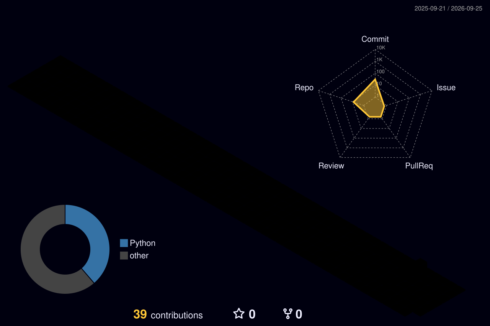

<div align="center">



<br/>

<a href="https://git.io/typing-svg">
  
</a>

<br/><br/>


[](https://linkedin.com/in/abdul-rehman-bhatti)
[](mailto:bhattiabdurehman987@gmail.com)

</div>

<br/>


## 🧠 About Me

I'm an **AI Automation Expert, AI Agent Developer, Full-Stack Web Developer, and Certified Ethical Hacker** — I design intelligent, secure, scalable systems that turn manual work into automated workflows.

```python
class AbdulRehmanBhatti:
    def __init__(self):
        self.role       = ["AI Automation Expert", "Agentic AI Engineer", "Full-Stack Dev", "Ethical Hacker"]
        self.stack      = ["Python", "LLMs", "AI Agents", "APIs", "Automation", "Cybersecurity"]
        self.currently  = "building agentic AI systems that solve real business problems"
        self.status     = "Final-Year BSCS Student 🎓"

    def say_hi(self):
        return "Let's build something intelligent together 🚀"
```

<br/>


## 🛠️ Tech Stack

<div align="center">


</div>

<br/>


## 🐍 Contribution Snake

<div align="center">

<picture>
  <source media="(prefers-color-scheme: dark)" srcset="https://raw.githubusercontent.com/arbhatti18/arbhatti18/output/github-contribution-grid-snake-dark.svg">
  <source media="(prefers-color-scheme: light)" srcset="https://raw.githubusercontent.com/arbhatti18/arbhatti18/output/github-contribution-grid-snake.svg">
  
</picture>

</div>

> Regenerates nightly via `workflows/snake.yml` — the snake literally eats your contribution graph. See setup below.

<br/>


## 🌌 3D Contribution Graph

<div align="center">

<!--START_SECTION:3d-contrib-->

<!--END_SECTION:3d-contrib-->

</div>

<br/>


## 🔥 Jet Heatmap

<div align="center">



</div>

> Generated with the Jet Heatmap generator — see `JET-HEATMAP-SETUP.md` for the token-based setup.

<br/>


## 📊 Stats & Trophies

<div align="center">


<br/>


<br/><br/>


</div>

<br/>


## ✍️ Dev Wisdom

<div align="center">


</div>

<br/>


## 🌐 Connect

<div align="center">

[](https://facebook.com/abdulrehmanbhatti)
[](https://instagram.com/iamthecyberbhatti)
[](https://x.com/arbhatti18)
[](https://reddit.com/user/abdulrehmanjr)
[](https://mastodon.social/@AbdulRehmanBhatti)

</div>


